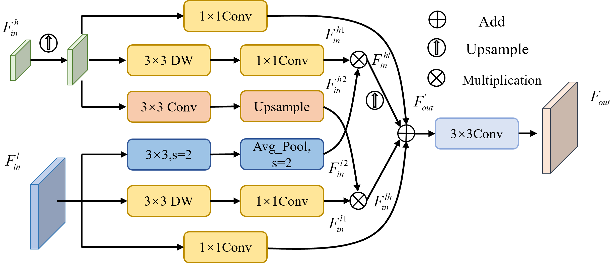

# Multi-Resolution Refinement Network for Semantic Segmentation in Internet of Things


## MRRNet

<p align="center">
  
  <span align="center">MRRNet Network Structure</span> 
</p>

### SRM
<p align="center">
  
  <span align="center">The architecture of SRM</span> 
</p>

### MSFPM

<p align="center">
  
  <span align="center">The architecture of MSFPM</span> 
</p>

### SAIM
<p align="center">
  
  <span align="center">The architecture of SAIM</span> 
</p>


## Use

### Prepare data

- Download the [Cityscapes](https://www.cityscapes-dataset.com/), [CamVid](http://mi.eng.cam.ac.uk/research/projects/VideoRec/CamVid/), and [NightCity](https://dmcv.sjtu.edu.cn/people/phd/tanxin/NightCity/index.html) datasets.
- Add the dataset path to `configs/_base_/datasets/xx(dataset).py`


### Pre-training

In real-time semantic segmentation,Network in ImageNet pre-training common methods, if you wish to use ImageNet for
pre-training you can refer to our method. We have used this project [ImageNet](https://github.com/jiweibo/ImageNet) for
pre-training.

### Train

the pre-trained weights we provided and put them into `pretrained_models/imagenet/`

Configure training parameters in the yaml file under the `config` folder, such
as `ExpName (experiment name)`, `ROOT (dataset directory)`,` END_EPOCH (training rounds)`, etc.

Start the training with our preset script train.sh or use the following command

```python tools/train.py --cfg configs/cityscapes/mrrnet_cityscapes_S.yaml```

### Evaluate

Download the training weights we provided and put them in `pretrained_models/cityscapes/`,`pretrained_models/camvid/` or `pretrained_models/nightcity/`

Configure evaluation parameters in the yaml file in the `config` folder, such as `ExpName`

```python tools/train.py --cfg=configs/cityscapes/mrrnet_cityscapes_S.yaml```

If you wish to submit the results of your test dataset to Cityscapes, change the `TEST_SET` parameter in the yaml file
in the `config` folder

## Experimental results

| Model (Cityscapes) | Val (% mIOU) | Test (% mIOU)| FPS |
|:-:|:-:|:-:|:-:|
| MRRNet-S | 78.7 | 78.1 | 112.6 |
| MRRNet-M | 79.7 | 79.3 | 79.8 |
| MRRNet-L | 80.2 | 79.8 | 59.2 |

| Model (CamVid) | Val (% mIOU) |  FPS |
|:-:|:-:|:-:|
| MRRNet-S | 78.9 | 175.7 |
| MRRNet-L | 80.2 | 85.7 |

| Model (NightCity) | Val (% mIOU) | FPS |
|:-:|:-:|:-:|
| MRRNet-S| 54.2 | 178.9 |

The test speed follows the DDRNet and PIDNet test methodology.

